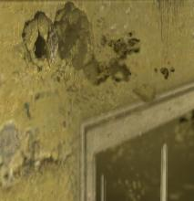

# Material System(s) {#materials}

## GoldSrc Material System {#gsmaterials}

In the GoldSrc games "Material" definitions handle what footsteps and what impact sounds are played against each texture in the game-world.

So when you walk on dirt, you can hear the difference; or when you shoot wood with a gun it will sound like wood.

**Note:** While Nuclide supports this for legacy BSP files, please define the surface properties inside your [material](Documentation/Materials/MatOverview.md) using the **surfaceprop** command.

### Details

Usually, a game in the GoldSrc engine would provide a `sound/materials.txt` file, where each line defines the properties for a single (or a series of) textures by starting with a material id character, followed by whitespace, followed by a name matching pattern.

For example:

`C CONCRETEWALL`

Will give any surface the id **C** if it starts with the name `CONCRETEWALL`.

It will also only compare the length of characters of the name above. So for example if you were to define:

`C CONC`

Then `CONCRETEWALL` would still be marked as concrete, and any other texture that starts with `CONC[...]`.

**Note:** In vanilla Half-Life, the second argument (name) can only be 12 characters long.

When you then walk around your level, the footstep will then be aware of you being on a texture marked with the **C** attribute and play a different step sound. Games are free to define what those material id characters mean - so different games/mods may interpret it differently.

Porting levels can sometimes be a bit more work than it first appears to be at first glance as a result!

### Later Enhancements

#### Community additions

In stock GoldSrc games, the `sound/materials.txt` can be overwritten by a modification but it couldn't be dynamically extended in any way.
This means there was no possibility of map specific materials, and mods could not inherit Half-Life's materials, so mods would always have to manage a nearly duplicate file if they desired custom material definitions.

A few mods tried to remedy this problem, the following below are methods
documented so far:

file named maps/MAPNAME.mat
: Introduced in The Wastes (2003)

file named maps/MAPNAME_materials.txt
: Convention by Andrew Lucas, creator of Trinity SDK, modeled after MAPNAME_details.txt

worldspawn entity key named 'materials_file' with the value `PATH_TO/FILE.txt`
: Introduced in Sven Co-op 5.0

**All these methods are supported by Nuclide**, as one goal is to implement
conventions by not only Valve but the community as well!

#### Nuclide additions

In addition Nuclide has also implemented a way of giving modifications
their own *inheritable* materials file:

`sounds/materials_UNIQUENAME.txt`

The idea here is that any mod or even map pack can include ONLY the textures
used, and no longer will anyone have to manage a near-clone of `sound/materials.txt`.

For repackaging or modding purposes, if you desire to give your map custom
material property definitions, we recommend **The Wastes** its method for individual maps,
while the Nuclide method should be used for **mods** or **map packs**.

**Note:** We recommend only using material text files for GoldSrc related modding
purposes. It is inefficient for modern projects as there are much better
standards already supported in Nuclide.

## Material List

In Nuclide, this is the currently supported list of material IDs:

| Material ID | Material Name |
|-------------|---------------|
| B           | Bloody Flesh  |
| C           | Concrete      |
| D           | Dirt          |
| F           | Flesh         |
| G           | Grate         |
| H           | Alien         |
| K           | Snow          |
| M           | Metal         |
| N           | Sand          |
| O           | Foliage       |
| P           | Computer      |
| S           | Slosh         |
| T           | Tile          |
| V           | Vent          |
| W           | Wood          |
| Y           | Glass         |

### Game differences

Different games/mods can ship with different material properties.
To make your life easier, you can edit **scripts/surfaceproperties.txt** and define
which Material ID character maps to which [surfaceproperty](Documentation/Surf_data.md) entry.
This way you can add new materials to existing legacy maps without writing a line of code.

Listed below are definitions for various games and mods. Only the changes and additions are listed since the rest are identical.

### GoldSrc Games/Mods

#### Arrangement

| Material ID       | Material Name       |
|-------------------|---------------------|
| B                 | Blue Texture        |
| N                 | Snow                |
| R                 | Red Texture         |
| U                 | Slime               |
| X                 | Yellow Texture      |
| Z                 | Black Texture       |

#### Counter-Strike

| Material ID       | Material Name       |
|-------------------|---------------------|
| N                 | Snow                |
| X                 | Grass               |

*Afraid of Monsters: DC, Natural Selection, and Snow War uses the same definitions.*

#### Cry of Fear

| Material ID       | Material Name       |
|-------------------|---------------------|
| B                 | Random Twig Snap    |
| H                 | Paper               |
| I                 | Mud                 |
| O                 | Sand                |
| P                 | Snow                |
| R                 | Gravel              |
| U                 | Grass               |
| Y                 | Broken Glass        |
| Z                 | Carpet              |

#### Gunman Chronicles

| Material ID       | Material Name       |
|-------------------|---------------------|
| G                 | Wood                |
| T                 | Rock                |
| V                 | Sand                |
| W                 | Unknown/Unused?     |

#### Firearms

| Material ID       | Material Name                           |
|-------------------|-----------------------------------------|
| B                 | Sandbag                                 |
| N                 | Snow                                    |
| U                 | No impact or decals, just smoke effects |

#### Heart of Evil

| Material ID       | Material Name       |
|-------------------|---------------------|
| U                 | Mud                 |

#### Hostile Intent

| Material ID       | Material Name       |
|-------------------|---------------------|
| A                 | Sand                |
| E                 | Foliage             |
| N                 | Snow                |
| R                 | Carpet              |
| U                 | Mud                 |
| Z                 | Grass               |

#### Household DEATH!

| Material ID       | Material Name       |
|-------------------|---------------------|
| H                 | Wood (Creaky)       |
| I                 | Grass               |

#### Night at the Office

| Material ID       | Material Name       |
|-------------------|---------------------|
| T                 | Carpet              |

#### Opposing Force

| Material ID       | Material Name       |
|-------------------|---------------------|
| O                 | Snow                |

*Science and Industry uses the same definitions as Opposing Force.*

#### Poke646

| Material ID | Material Name |
|-------------------|---------------------|
| M                 | Metal/Grate         |
| T                 | Wood/Tile           |
| G                 | Carpet/Grass        |

#### Wasteland Half-Life

| Material ID       | Material Name       |
|-------------------|---------------------|
| B                 | Barrel              |
| I                 | Sand                |
| N                 | Tinroof             |
| R                 | Rust                |
| U                 | Drywall             |

*The Wastes uses the same definitions.*

### Source Engine Games/Mods

While Source has materials describing a surface with its own **$surfaceprop** command, the GoldSrc way of describing materials with a 1-character symbol is still used to define which **impact effect** to use.

The **Material ID** is used via the `gamematerial` command inside **scripts/surfaceproperties.txt** entries. In Nuclide that's used for compatibility with the GoldSrc system instead.

Be aware that a Source engine game may actually have more surface materials than this, these are *solely the IDs associated with impact effects*.

#### Alien Swarm

| Material ID       | Material Name       |
|-------------------|---------------------|
| 11                | Steam Pipe          |

**Alien Swarm: Reactive Drop uses the same definitions.**

#### Counter-Strike: Global Offensive

| Material ID       | Material Name             |
|-------------------|---------------------------|
| 11                | Mud                       |
| 12                | Sand Barrel               |
| 13                | Sand Barrel (Penetration) |
| 14                | Metal Shield              |

#### Half-Life 2

| Material ID       | Material Name       |
|-------------------|---------------------|
| A                 | Antlion             |
| B                 | Flesh (Bloody)      |
| H                 | Flesh (Antlion)     |
| K                 | Snow                |
| L                 | Plastic             |
| N                 | Sand                |
| I                 | Clip                |
| O                 | Foliage             |
| X                 | Fake                |
| -                 | No Decal            |

#### Half-Life 2: Episode 2

| Material ID       | Material Name       |
|-------------------|---------------------|
| E                 | Antlion Egg Sacks   |
| Z                 | Adviser Shield      |

#### Insurgency

| Material ID       | Material Name       |
|-------------------|---------------------|
| A                 | Fruit               |

*Day of Infamy uses the same definitions.*

#### Left 4 Dead

| Material ID       | Material Name       |
|-------------------|---------------------|
| J                 | Grass               |
| K                 | Mud                 |
| Q                 | Asphalt             |
| R                 | Brick               |
| U                 | Cardboard           |
| 1                 | Clay                |
| 2                 | Plaster             |
| 3                 | Rock                |
| 4                 | Rubber              |
| 5                 | Sheetrock           |
| 6                 | Cloth               |
| 7                 | Carpet              |
| 8                 | Paper               |
| 9                 | Upholstery          |
| 10                | Puddle              |

#### Portal 2

| Material ID       | Material Name       |
|-------------------|---------------------|
| R                 | Reflective          |
